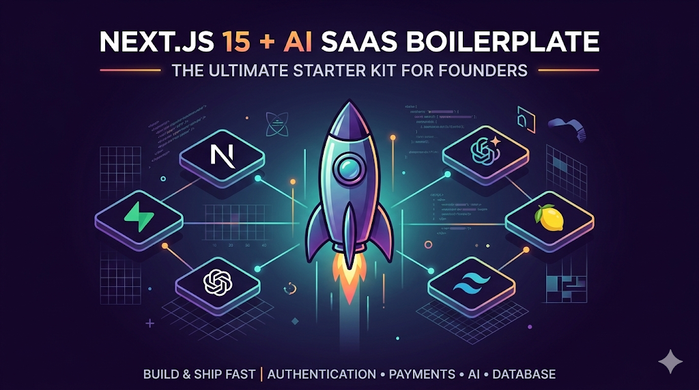

# 🚀 SaaS Boilerplate

The ultimate Next.js 15 starter kit for founders who want to build and ship fast. Focus on your unique product, not the infrastructure.



## ✨ Features

- **Framework**: Next.js 15 (App Router, Server Actions)
- **Styling**: Tailwind CSS v4 + Shadcn UI
- **Database**: Supabase (PostgreSQL)
- **Authentication**: Supabase Auth (Email + OAuth like Google)
- **Payments**: Lemon Squeezy (Subscriptions + Webhooks handling)
- **AI Integration**: Vercel AI SDK + Google Gemini / OpenAI Support
- **Theming**: Premium "Tokyo Night" Dark Mode Support
- **Components**: Pre-built Landing Page, Dashboard, Pricing, Legal pages.

---

## 🛠️ Quick Setup

### 1. Clone & Install
```bash
git clone <your-repo-url> my-saas
cd my-saas
npm install
```

### 2. Environment Variables Configuration
Copy the example environment file:
```bash
cp .env.local.example .env.local
```
You will need to fill out `.env.local` as you complete the following steps.
**Required variables to find:**
- `NEXT_PUBLIC_APP_URL` (e.g., `http://localhost:3000` or your production domain)
- **Supabase**: URL, Anon Key, Service Role Key
- **Lemon Squeezy**: Webhook Secret, API Key, Store ID, Variant ID
- **AI**: `GOOGLE_GENERATIVE_AI_API_KEY` (or OpenAI)

### 3. Supabase Setup (Database & Auth)
1. Create a project at [Supabase](https://supabase.com/).
2. Grab your **Project URL** and **Anon Key** (Settings -> API) and add them to `.env.local`.
3. Grab the **Service Role Key** (Keep this secure!) and add it to `.env.local`.
4. **CRITICAL STEP - Database Schema:** 
   Go to the **SQL Editor** in your Supabase dashboard. Open the file `supabase/migrations/00_init.sql` from this repository, paste its contents into the SQL Editor, and click **Run**.
   *This creates the necessary `profiles` table, enables Row Level Security (RLS), and sets up the Postgres Trigger that automatically creates a profile when a user signs up.*

### 4. Lemon Squeezy Setup (Payments)
1. Create a store at [Lemon Squeezy](https://www.lemonsqueezy.com/).
2. Go to **Settings -> API** and generate an API key. Add it to `LEMON_SQUEEZY_API_KEY` in `.env.local`.
3. Find your **Store ID** in the Lemon Squeezy settings and add it to `LEMON_SQUEEZY_STORE_ID`.
4. Create a Product and a Variant (e.g., "Pro Subscription"). Grab the **Variant ID** from the product settings and add it to `LEMON_SQUEEZY_VARIANT_ID`.
5. **CRITICAL STEP - Webhooks:**
   - Go to **Settings -> Webhooks** and click `+` to add a new webhook.
   - **URL:** `https://yourdomain.com/api/webhooks/lemon-squeezy` *(Use Ngrok for local testing: `https://<ngrok-url>/api/webhooks/lemon-squeezy`)*
   - **Signing Secret:** Create a strong, unique password/string here.
   - **Events to Select:** `order_created`, `subscription_created`, `subscription_updated`, `subscription_cancelled`, `subscription_expired`.
   - **Important:** Paste the Signing Secret you just created into `LEMON_SQUEEZY_WEBHOOK_SECRET` in your `.env.local`. *Without this, the app will reject all payment webhooks with a 401 error.*

### 5. AI Integration Setup
1. Get an API key from [Google AI Studio](https://aistudio.google.com/) for Gemini.
2. Add the key to `GOOGLE_GENERATIVE_AI_API_KEY` in `.env.local`.
3. *(Alternative)* If using OpenAI, provide `OPENAI_API_KEY`.

### 6. Run the App
```bash
npm run dev
```
Open [http://localhost:3000](http://localhost:3000)

---

## 📜 License

This is a commercial boilerplate.
- **You CAN**: Use this code to build unlimited SaaS products for yourself or clients and make money from those apps.
- **You CANNOT**: Resell, redistribute, or openly share the raw source code or claim it as your own boilerplate product.

Built by [Your Name/Company].
